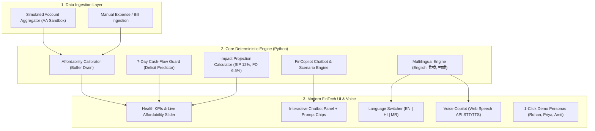

# Financial Health Copilot 🛡️
> **Personalized, Affordability-Calibrated Financial Health Copilot & Conversational Assistant**  
> *Developed for HackMatrix 5.0 (Track: FIN-02 — SDG-Driven AI/ML Hackathon, PCCOE Pune)*  
> *50–60% Functional, Judge-Ready Prototype*

[](https://www.python.org/)
[](https://fastapi.tiangolo.com/)
[](#)
[](#)
[](LICENSE)

---

## 💡 The Core Problem

Conventional personal finance tools and robo-advisors fail everyday users because they rely on **generic income-tier heuristics**:
- *"Save 20% of your gross income"*
- *"Invest ₹10,000 every month in an index fund"*

**Why this breaks in the real world:**
- **The High-Burn Trap:** An individual earning ₹1,25,000/month whose fixed rent, EMIs, and lifestyle commitments total ₹1,15,000 has only **₹10,000 in true disposable surplus**. Forcing a generic 20% rule (₹25,000) causes cash-flow distress, bounced debits, or high-interest credit card debt.
- **The Frugal Saver Opportunity:** An individual earning ₹50,000/month with modest lifestyle expenses of ₹20,000 has a healthy **₹30,000 disposable surplus** and can safely invest 40–50% of their income, but generic apps conservatively under-invest them.
- **Scattered Silos & Surprise Shortfalls:** Users track bank accounts, credit cards, and investments across separate apps. Nobody warns them 5 days before an EMI bounces due to timing mismatches between cash inflows and debits.
- **Language Barriers in Financial Advisory:** Tier-2 and regional users in Maharashtra and across India are excluded from institutional financial planning because interfaces are predominantly English-only.

---

## 🎯 Our Solution & Core Innovations

**Financial Health Copilot** is an SDG-aligned decision-support copilot that delivers:

1. **Context-Aware Financial Chatbot (FinCopilot):** An interactive conversational AI assistant that calculates scenario queries in real time:
   - *"Can I buy a ₹40,000 phone on 6-month EMI?"*
   - *"What if I reduce dining out by 30%?"*
   - *"Why is my 7-day cash flow at risk?"*
2. **Multilingual Regional Accessibility (English, हिन्दी, मराठी):**  
   Designed specifically for **HackMatrix 5.0 at PCCOE Pune (Maharashtra)**, the system offers 1-click dynamic switching across **English**, **हिन्दी**, and **मराठी**, including localized UI text, risk badges, chatbot dialogue, and native Web Speech API synthesis (`mr-IN`, `hi-IN`, `en-IN`). Directly advances **SDG 10: Reduced Inequalities**.
3. **Calibrated Disposable Affordability Math:** Evaluates investment safety using deterministic mathematical models:
   $$\text{Disposable Income} = \text{Monthly Income} - (\text{Fixed Commitments} + \text{Lifestyle Expenses})$$
   Factors in emergency fund coverage (months of runway) as a mandatory health check.
4. **Proactive 7-Day Cash-Flow Guard:** Scans rolling 5–7 day calendar horizons for upcoming bills (Rent, EMIs, Utilities) against available liquid checking balance to alert users before auto-debits bounce.
5. **Expected Impact Projections:** Visualizes compound returns across Equity SIP (12% CAGR), Conservative Fixed Deposits (6.5% CAGR), and Cash Mattress (0% Baseline) over 1, 3, 5, and 10 years.
6. **Explainability & Provenance Feed:** Labels every insight as an **`OBSERVED FACT`**, **`MODEL PREDICTION`**, or **`ACTIONABLE RECOMMENDATION`** with explicit confidence indicators and data provenance.
7. **Simulated Account Aggregator (AA) Sandbox:** Features an interactive simulation of the RBI-regulated Account Aggregator framework (Setu / Finvu style consent and OTP handshake) alongside a manual entry fallback.

---

## 🏗️ Architecture & System Flow



---

## 👥 Judge Demo Personas (Preloaded)

To verify the core differentiator immediately, three realistic Indian financial profiles are embedded:

| Persona | Profile Type | Income | Monthly Spend | Disposable | Emergency Runway | Copilot Insight |
| :--- | :--- | :---: | :---: | :---: | :---: | :--- |
| **Rohan Mehta** | High Earner, High Burn | ₹1,25,000 | ₹1,15,000 | **₹10,000** | 0.4 months | 🛑 **Generic 20% rule fails.** Copilot flags investing >₹4,000 as high risk due to thin disposable cushion. |
| **Priya Sharma** | Frugal Moderate Saver | ₹52,000 | ₹28,000 | **₹24,000** | 5.8 months | ✅ **Comfortable capacity.** Copilot approves investing up to ₹12,000–₹15,000 backed by strong emergency reserves. |
| **Amit Verma** | Imminent Cash Crunch | ₹68,000 | ₹35,300 | ₹32,700 | ₹14,500 cash | ⚠️ **7-Day Deficit Alert.** ₹25,500 in bills due in next 4 days vs ₹14,500 balance $\to$ flags ₹11,000 impending shortfall. |

---

## ⚡ Quickstart Guide

### 1. Prerequisites
- **Python 3.11+** installed.
- Modern web browser (Chrome, Edge, or Brave recommended for Web Speech voice support).

### 2. Installation
Clone the repository and install dependencies:
```bash
git clone https://github.com/aarush-matrix/financial-health-copilot.git
cd financial-health-copilot
pip install -r requirements.txt
```

### 3. Run Application Server
Start the FastAPI server:
```bash
# Double-click run.bat or execute:
python -m uvicorn app.main:app --host 127.0.0.1 --port 8000 --reload
```

Open your browser to:
- **Web Dashboard:** [http://127.0.0.1:8000](http://127.0.0.1:8000)
- **Interactive Swagger API Docs:** [http://127.0.0.1:8000/docs](http://127.0.0.1:8000/docs)

### 4. Run Automated Test Suite
Verify mathematical correctness, chatbot logic, and regional translations (21 unit tests):
```bash
python -m unittest discover tests -v
```

---

## 🔬 Mathematical Specifications

### 1. Affordability & Buffer Drain Formula
$$\text{Disposable Margin} = \text{Income} - (\text{Fixed Obligations} + \text{Lifestyle Discretionary})$$
$$\text{Buffer Drain Ratio} = \frac{\text{Tested Monthly Investment}}{\max(1, \text{Disposable Margin})}$$
- **SAFE**: Drain $\le 40\%$, Residual Buffer $\ge ₹5,000$, Emergency Runway $\ge 3.0$ months.
- **MODERATE**: Drain between $40\%$ and $70\%$, Residual Buffer $\ge ₹3,000$.
- **RISKY**: Drain $> 70\%$, Residual Buffer $< ₹3,000$, or Emergency Runway $< 1.5$ months.
- **CRITICAL**: Investment exceeds Disposable Margin ($< 0$ residual buffer).

### 2. Forward Cash-Flow Shortfall
$$\text{Shortfall} = \max\left(0, \sum_{i \in \text{due within 7 days}} \text{Bill}_i - \text{Liquid Checking Balance}\right)$$

### 3. Systematic Investment Plan (SIP) Compounding
$$\text{FV} = P \times \left[ \frac{(1 + r)^n - 1}{r} \right] \times (1 + r)$$
Where $P = \text{Monthly Investment}$, $r = \frac{R}{12}$, and $n = \text{Years} \times 12$.

---

## ⚖️ Regulatory Notice & SEBI Framing

> **Educational Decision-Support Only:**  
> The Financial Health Copilot provides algorithmic calculations and educational guidance. It **does not** constitute formal investment advice or portfolio management under SEBI (Investment Advisers) Regulations, 2013.

---

## 🌍 UN Sustainable Development Goals (SDG) Alignment
- **SDG 8: Decent Work and Economic Growth** — Preventing predatory debt spirals and default penalties through proactive cash-flow warnings.
- **SDG 10: Reduced Inequalities** — Democratizing calibrated financial guidance across regional Indian languages (**मराठी** and **हिन्दी**).
